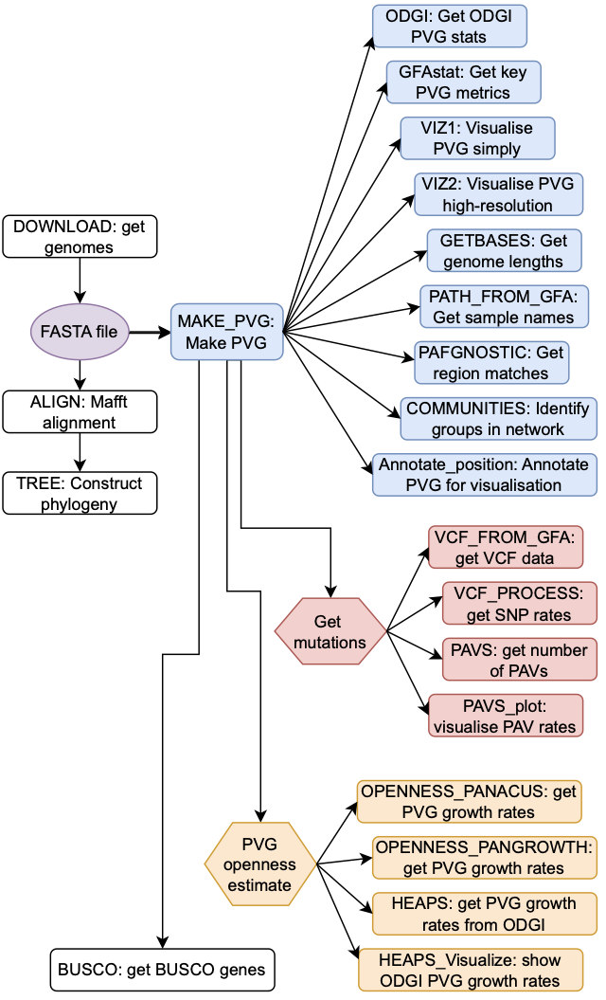

## Table of contents

- [Overview](#overview)
- [Installation](#installation)
- [Examples](#examples)
- [Module selection](#module-selection)
- [How does it work?](#how-does-it-work)
- [Main components](#main-components)
- [Dependencies](#dependencies)
- [Template file format](#template-file-format)
- [Troubleshooting](#troubleshooting)
- [Credits](#credits)
- [License](#mit-license)

# Overview

Panalyze can make and analyse [pangenome variation graphs (PVGs)](https://doi.org/10.1093/bioinformatics/btac743). This was mainly designed with virus genomes in mind. It takes in a FASTA file of related sequences and constructs a PVG from them using [PGGB](https://github.com/pangenome/pggb). It visualises the PVG using [VG](https://github.com/vgteam/vg) and [ODGI](https://github.com/pangenome/odgi), and summarises it numerically using [GFAtools](https://github.com/lh3/gfatools) and ODGI. It calculates PVG openness using [Panacus](https://github.com/marschall-lab/panacus), [Pangrowth](https://peercommunityjournal.org/item/10.24072/pcjournal.415.pdf) and ODGI's heaps function. It gets the sample genome sizes and allocates them into communities (ie, groups) based on similarity. It identifies mutations in the form of VCFs using GFAutil and gets presence-absence variants (PAVs). It has a range of optional functions, like downloading a query to create the input FASTA, and using the [BUSCO database](https://busco.ezlab.org/) to quantify the numbers of genes in the samples of interest.

You can read our preprint [here](https://www.biorxiv.org/content/10.1101/2025.04.10.646565) and some ideas behind this [here](https://arxiv.org/abs/2412.05096). Panalyze works in a [Docker](https://www.docker.com/resources/what-container) container and runs in [NextFlow](https://www.nextflow.io/).

## Installation

Panalyze requires `docker` and `Nextflow`. For installation of these, please follow instructions at https://docker.com and https://www.nextflow.io/ that matches your environment.    

Clone the directory

    git clone https://github.com/downingtim/Panalyze/

Go to the folder

    cd Panalyze

Run in Nextflow given a template YML file and an example FASTA file. You may need to activate docker and R to ensure it works smoothly. You need Java version 11+ as well.

For example, we can examine a small set of goatpox virus (GTPV) genomes:

    nextflow run main.nf --config templates/template.GTPV.yml --reference test_data/GTPV.fa

Note that for your own samples, you will need to remove special characters in the fasta files. In addition, to ensure compatibility with other pangenome graph tools, please adhere to the [PanSN-spec: Pangenome Sequence Naming](https://github.com/pangenome/PanSN-spec) guidance, which basically means adding a hash and a digit onto the end of the sequence names.

## Examples ## 
We have added a selection of viral genomes to represent a common range of sizes, nucleic acid composition as examples. You can run the analysis for each dataset using the command: 

     nextflow run main.nf --config <config.yml> --reference <reference.fa>

Where the `config.yml` file and the `reference.fa` file are taken from the columns `Config file` and `Reference` columns respectively. If no reference is given, the analysis can be run with the command
     
     nextflow run main.nf --config <config.yml>

and the datasets will be downloaded automatically.

## RNA virus examples - FMDV serotypes ##

| Dataset (count) | Config file | Reference | Notes |
|---|---:|---|---|
| FMDV serotype A (142) | templates/template.FMDV.A.yml | test_data/FMDV.A.fa | Foot-and-mouth disease virus (FMDV) — serotype A; RNA virus; 142 sequences |
| FMDV serotype O (441) | templates/template.FMDV.O.yml | test_data/FMDV.O.fa | Foot-and-mouth disease virus (FMDV) — serotype O; RNA virus; 441 sequences |
| FMDV serotype C (18) | templates/template.FMDV.C.yml | test_data/FMDV.C.fa | Foot-and-mouth disease virus (FMDV) — serotype C; RNA virus; 18 sequences |


## DNA virus examples - capripoxviruses ##

| Dataset (count) | Config file | Reference | Notes |
|---|---:|---|---|
| LSDV 7.5 Kb (132; 2.5–10 Kb) | templates/template.LSDV.10kb.yml | test_data/LSDV.10kb.fa | Lumpy skin disease virus (LSDV); DNA poxvirus; 132 sequences; fragments selected (~2.5–10 Kb) |
| LSDV 5 Kb (132; 135–140 Kb) | templates/template.LSDV.135kb.yml | test_data/LSDV.135kb.fa | Lumpy skin disease virus (LSDV); DNA poxvirus; 132 sequences; genomic region ~135–140 Kb |
| SPPV (29) | templates/template.SPPV.yml | test_data/SPPV.fa | Sheeppox virus (SPPV); DNA poxvirus; 29 sequences |
| LSDV (121) | templates/template.LSDV.yml | test_data/LSDV.fa | Lumpy skin disease virus (LSDV); DNA poxvirus; full genomes; 121 sequences |


## Segmented virus examples ##

| Dataset (count) | Config file | Reference | Notes |
|---|---:|---|---|
| RVFV S (414) | templates/template.RVFV.S.yml | test_data/RVFV.S.fa | Rift Valley fever virus (RVFV) — S segment; RNA virus; 414 sequences |
| RVFV M (302) | templates/template.RVFV.M.yml | test_data/RVFV.M.fa | Rift Valley fever virus (RVFV) — M segment; RNA virus; 302 sequences |
| RVFV L (306) | templates/template.RVFV.L.yml | test_data/RVFV.L.fa | Rift Valley fever virus (RVFV) — L segment; RNA virus; 306 sequences |


## Examples of viral downloads ##

| Dataset (count) | Config file | Reference | Notes |
|---|---:|---|---|
| GTPV (~14; download) | templates/template.GTPV.all.yml | (download configured in template) | Goatpox virus (GTPV); DNA poxvirus; input downloaded via template |
| PRCV (~15; download) | templates/template.PRCV.all.yml | (download configured in template) | Porcine respiratory coronavirus (PRCV); RNA coronavirus; input downloaded via template |


## How does it work?



Panalyze is a collection tools to analyze Pangenomes of a given set of FASTA files. The files are either supplied by the user or downloaded from the NCBI. Panalyze uses nextflow with docker containers to run the pipeline. Nextflow runs the `main.nf` file, which in turn will use modules defined in `modules/processes.nf`. The modules in the workflow can be configured and enabled using a template file defined as a YAML file. The format of the template file is described [here](#template-file-format). In your own template file, you will need to define the dataset name, number of haplotypes, max number of CPUs available, minimum expected genome size, sample name filtering if using the download function, and the BUSCO clade (if relevant).
The modules can be actived and deactivated in the template file by marking the associated component in the 'MODULES' section with a 1 or 0 respectively.
The individual modules, their inputs and outputs are described next.


## Main components:

### DOWNLOAD (optional)
- Purpose: download genomes from NCBI Nucleotide using a search/query.
- Inputs: VIRUS.name / VIRUS.filter specified in the template.
- Outputs: `results/download/<dataset>.fa`, `results/download/metadata.tsv`
- Notes: uses Esearch/Efetch; enforces PanSN naming when enabled; requires internet.

#### ALIGN (optional)
- Purpose: create MSA and estimate phylogeny.
- Inputs: FASTA (downloaded or local).
- Outputs: `results/align/alignment.fa`, `results/align/raxml.tree` - The MSA alignment file and the RAxML phylogeny construction files.
- Notes: CPU/memory dependent; useful for QC and tree-based analyses.

#### TREE (optional)
- Purpose: render phylogeny for inspection.
- Inputs: RAxML tree - a PNG visualisation of the phylogeny.
- Outputs: `results/align/tree.png` (or `.pdf`)

#### MAKE_PVG (core)
- Purpose: build the pangenome variation graph with PGGB.
- Inputs: FASTA (downloaded or local).
- Outputs: `results/PVG/pggb.gfa` (+ PGGB intermediates)
- Notes: default identity 90% and match length 1 kb (configurable).

#### VIZ1 (core)
- Purpose: Create a PVG visualisation PNG with VG's view function and dot.
- Inputs: VG/PGGB outputs.
- Outputs: `results/vg/out.vg.png` - the visualisation.
- Notes: large, slow and memory-intensive.

#### ODGI (core)
- Purpose: convert GFA and compute ODGI representations/metrics.
- Inputs: GFA from PGGB.
- Outputs: `results/odgi/out.og`, `results/odgi/odgi.stats.txt` - the metrics on the PVG from ODGI, and the ODGI file.
- Notes: required by many downstream visualisations and metrics.

#### OPENNESS_PANACUS (core)
- Purpose: Get the number of haplotyopes present, estimate and visualize the rates of PVG growth as more samples are added.
- Inputs: sequences/graph as prepared by prior steps.
- Outputs: `results/panacus/haplotypes.txt`, `results/panacus/histgrowth.node.tsv`, `results/panacus/histgrowth.node.pdf` - the haplotypes found, the rates of changes in the PVG size as the sample size varied, and a visualisation of the PVG openness.

#### OPENNESS_PANGROWTH (core)
- Purpose: growth curves, allele frequency spectrum (AFS) and core-size estimation.
- Inputs: split sequence files and fastix preparation
- Outputs: `results/pangrowth/pangrowth.pdf`, `results/pangrowth/growth.pdf`, `results/pangrowth/p_core.pdf` - The shared PVG size estimates as text and PDF, the rates of change in k-mers as a function of the sample size, and a histogram of the k-mers versus different sample sizes.

#### PATH_FROM_GFA (core)
- Purpose: extract sample/path names from the GFA for other modules.
- Outputs: `results/pvg/sample_paths.txt` - the list of samples

#### VCF_FROM_GFA (core)
- Purpose: convert graph variants to a VCF.
- Inputs: GFA
- Outputs: `results/vcf/gfavariants.vcf` - a VCF file of the mutations.
- Notes: uses gfautil; VCF feeds downstream SNP analyses.

#### VCF_PROCESS (core)
- Purpose: compute pairwise differences, SNP densities and AFS from VCFs and visualise.
- Inputs: VCFs
- Outputs: `results/vcf/variation_map-basic.pdf`, `results/vcf/mutation_density.pdf`, `results/vcf/afs_counts.txt` - a plot of the difference in genome coordinates across samples (PNG), a simple visualisation of mutation density across the genome (as PDF), and the allele frequency spectrum (AFS) counts.

#### GETBASES (core)
- Purpose: projects the graph sequence and paths into FASTA and BED..
- Inputs: graph mappings
- Outputs: `results/getbases/out.bed`, `results/getbases/genome_lengths.txt` - the BED file and genome lengths (for QC).

#### VIZ2 (core)
- Purpose: large-scale PVG visualisations with odgi viz.
- Outputs: `results/odgi/out.viz.png`  - a visualisation of the ODGI viz of the PVG alignment across genomes showing major SVs.
- Notes: produces publication-ready images; can be large.

#### HEAPS (core)
- Purpose: Run Odgi's heaps function across all samples to get rate of PVG growth.
- Inputs: odgi/graph-derived data
- Outputs: `results/heaps/heaps.txt` - data for HEAPS_Visualize.

#### HEAPS_Visualize (core)
- Purpose: plot heaps results for visualization.
- Inputs: `results/heaps/heaps.txt`
- Outputs: `results/heaps/heaps.pdf`- a visualisation of the PVG size changes as a function of the number of samples.
- Notes: can be slow for large datasets.

#### PAVS (core)
- Purpose: Use Odgi to get presence-absence variants (PAVs), and quantify the number of PAVs.  
- Outputs: `results/pavs/*.pav`,  `results/pavs/out.flatten.fa` - data for PAVS_plot.
- Notes: PAV files can be large.

#### PAVS_plot (core)
- Purpose: visualise PAVs
- Inputs: PAV outputs
- Outputs: `results/pavs/out.flatten.pavs.pdf` - a PDF visualisation of the PAV frequency and some summary metrics.

#### COMMUNITIES (core)
- Purpose: quantify the number of communities with wfmash, and convert these into a network for visualization.
- Inputs: genome FASTAs
- Outputs: `results/communities/genomes.mapping.paf`, `results/communities/communities.tsv` - data on the communities. This includes the genetic distances, the inter-sample PAF file mapping, PAF file weights, community text files, a visualisation of the community groups (PDF).
- Notes: defaults: 90% similarity and ≥6 mappings per segment (configurable).

#### PAFGNOSTIC (core)
- Purpose: Create a text file of the mapping from the COMMUNITIES.
- Inputs: PAFs
- Outputs: `results/pafgnostic/pafgnostic.txt` - metrics on the PVG.

#### GFAstat (core)
- Purpose: compute GFA-based PVG statistics, and genome lengths.
- Inputs: GFA
- Outputs: `results/gfastat/gfa.stats.txt`, `results/gfastat/genome.lengths.txt` - metrics on the PVG and the sample genome lengths.

#### Annotate_Position (core)
- Purpose:  Use ODGI to map PVG nodes to annotation data and provide instructions on using Bandage.
- Inputs: GFF/GTF and odgi mappings
- Outputs: `results/annotation/node_to_feature.tsv` - the annotation CSV file for Bandage.
- Notes: helps link graph features to genes.

#### BUSCO (optional)
- Purpose: Use Busco to count the number of BUSCO genes present.
- Inputs: assemblies or extracted contigs; set VIRUS.busco_clade in template.
- Outputs: `results/busco/<sample>/short_summary.txt` 
- Notes: runtime varies with clade and dataset size.

Configuration & best-practice notes
- Toggle modules in MODULES with 1/0. Dependent modules may auto-enable.
- Heavy stages: MAKE_PVG (PGGB), HEAPS_Visualize, PAVS — run on HPC or increase cpus/memory.

## Troubleshooting
### Speeding up

You can skip some modules: the HEAPS_Visualize module takes a considerable amount of time. Toggle these using the template file.  


### Java issue

In the event that you have a Java version issue when running Nextflow, you should ensure you have version 11 or higher and the commands below may assist (you may need to edit these):

    export JAVA_HOME=/cm/shared/apps/mambaforge/envs/tools
    export PATH=$JAVA_HOME/bin:$PATH


### Docker image issues 

You may need to remove old docker images using `docker rmi 1234567` where 1234567 is an older docker image of Panalyze. The command below may be a useful starting point, which removes all docker images. You might need to run these on the nodes of your HPC as well.

```docker rmi "\$(docker images  -q)" -f```


## Dependencies

Panalyze is based on the following tools and scripts. These are packaged in  docker images.

1.  Esearch and efetch
2.  Mafft
3.  RAxML
4.  R
5.  VG
6.  dot
7.  PGGB
8.  ODGI
9.  Panacus
10. Pangrowth
11. Gfautil
12. Wfmash
13. Pafgnostic
14. GFAstats
15. Busco
16. Bgzip
17. SAMtools
18. Mash
19. Gffread
20. Prokka

## Template file format
The template file controls the parameters of the pipeline. It has the following sections.
- PROCESS - Controls the processing environment
- VIRUS - Provides parameters related to the virus analysis
- MODULES - Toggles modules

Following is a description of the parameters for these sections
### PROCESS:
-   executor: <string> (optional)
     - HPC executor to use (e.g., "slurm", "sge", "local"). If commented out or absent,
       a default/local executor will be used (For laptops this is the correct setting). Adjust to match your compute environment.
     - cpus: <int> Number of CPU cores to allocate to the pipeline 

### VIRUS:
   - name: <string> (optional)
     Search/query string for the target virus. Multiple terms may be combined using "OR" (e.g., "goatpox virus OR GTPV"). This is for metadata/search purposes only.
   - filter: <comma-separated list> (optional)
      Comma-separated synonyms or tokens used to filter/identify sequences (e.g.,
       "goatpox virus, GTPV, goatpox"). Keep entries concise and consistent with metadata.
   - busco_clade: <string> (optional)
     BUSCO lineage dataset name (e.g., "poxviridae_odb10"). If present, BUSCO analysis
       will be executed for assemblies. 
   - haplotypes: <int>
     Expected number of haplotypes to consider during analyses
   - genome_length: <int>
     Expected genome size (in bases). 
   - pansn_convert : <int> 
     Convert the reference in to Pan-SN format if set to 1

 ### MODULES:
 Each key under MODULES toggles a pipeline stage/module.
 Value: 0 = disabled (skip this stage), 1 = enabled (run this stage). If a module depends on the execution of another module is enabled, the dependant modules are automatically executed even if they are turned off.
    

 Notes & best practices:
   - Toggle modules to 1 only for stages you want executed; turning off expensive steps
     can speed up testing runs.
   - Keep numeric values as integers (no quotes) where appropriate (cpus, haplotypes, etc.).
   - Maintain correct YAML indentation and types when editing this file.

## Credits

Tim Downing, Chandana Tennakoon, Thibaut Freville

## MIT License

Copyright (c) [2025] [Panalyze] 

Permission is hereby granted, free of charge, to any person obtaining a copy
of this software and associated documentation files (the "Software"), to deal
in the Software without restriction, including without limitation the rights
to use, copy, modify, merge, publish, distribute, sublicense, and/or sell
copies of the Software, and to permit persons to whom the Software is
furnished to do so, subject to the following conditions:

The above copyright notice and this permission notice shall be included in all
copies or substantial portions of the Software.

THE SOFTWARE IS PROVIDED "AS IS", WITHOUT WARRANTY OF ANY KIND, EXPRESS OR
IMPLIED, INCLUDING BUT NOT LIMITED TO THE WARRANTIES OF MERCHANTABILITY,
FITNESS FOR A PARTICULAR PURPOSE AND NONINFRINGEMENT. IN NO EVENT SHALL THE
AUTHORS OR COPYRIGHT HOLDERS BE LIABLE FOR ANY CLAIM, DAMAGES OR OTHER
LIABILITY, WHETHER IN AN ACTION OF CONTRACT, TORT OR OTHERWISE, ARISING FROM,
OUT OF OR IN CONNECTION WITH THE SOFTWARE OR THE USE OR OTHER DEALINGS IN THE
SOFTWARE.
